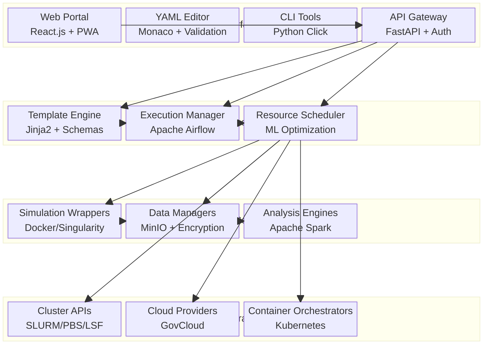
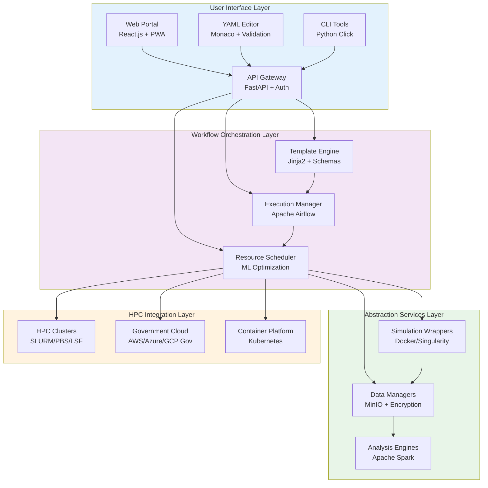
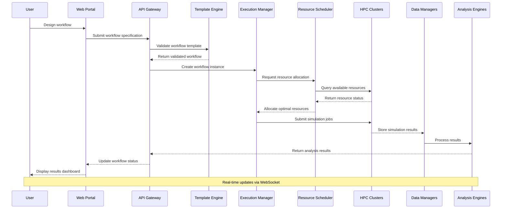
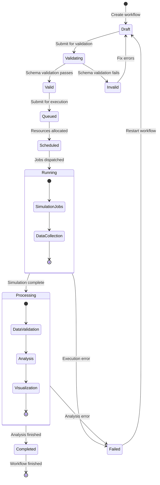
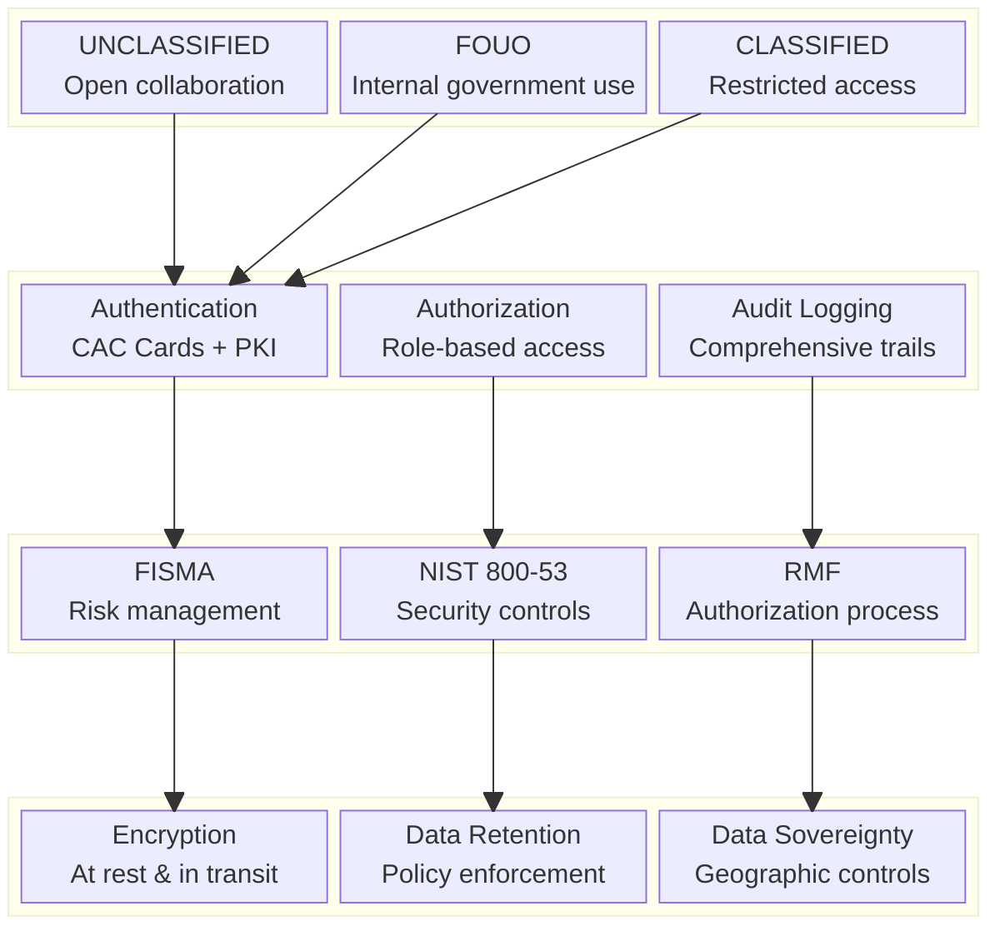
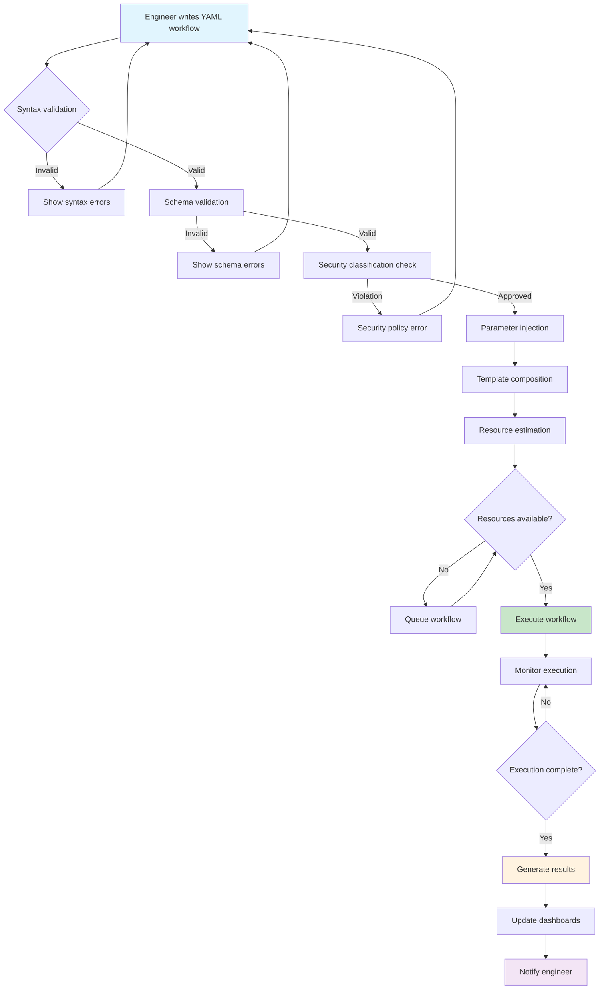

# HPC Workflow Toolkit for Engineers
## Comprehensive Development Plan

---

## Executive Summary & Vision

### Vision Statement
Create an HPC workflow toolkit that transforms high-performance computing from a developer's tool into an engineer's instrument - enabling government engineering practitioners to harness institutional computational resources through intuitive interfaces that align with their problem-solving methodologies while ensuring security, compliance, and organizational knowledge retention.

### Value Proposition
- **For Government Engineers**: Focus on mission-critical engineering problems, not computing infrastructure
- **For the Institution**: Maximize utilization of government HPC investments while ensuring security and compliance
- **For Government Programs**: Accelerate research and development cycles while maintaining rigorous documentation and reproducibility standards
- **For Institutional Knowledge**: Preserve and transfer engineering workflows as organizational assets

### Key Differentiators
Unlike developer-focused SDKs or commercial solutions, this government-focused toolkit provides:
- Domain-specific workflow templates for government engineering applications (defense systems, infrastructure, research)
- Multiple interface options including visual workflow composition AND text-based YAML workflow definition
- Integrated result analysis with government reporting requirements
- Self-service deployment within institutional security boundaries
- Built-in compliance with government standards (NIST, FISMA, export control)
- Organizational workflow libraries that capture institutional knowledge

---

## Engineering User Analysis

### Primary User Personas

#### Computational Engineer
- **Background**: Advanced degree in engineering discipline, 5-15 years experience
- **Current Tools**: MATLAB, Python, specialized simulation software (ANSYS, Abaqus, etc.)
- **Pain Points**: 
  - Scaling analyses beyond desktop limitations
  - Managing parameter sweeps and optimization studies
  - Integrating multiple simulation tools in workflows
- **Success Metrics**: Faster iteration cycles, larger problem sizes, automated optimization

#### Design Engineer
- **Background**: Engineering degree, 3-10 years experience, primarily GUI-driven tools
- **Current Tools**: CAD software, basic simulation packages
- **Pain Points**:
  - Limited to simplified analyses due to computational constraints
  - Manual processes for design space exploration
  - Difficulty accessing advanced simulation capabilities
- **Success Metrics**: Access to advanced analyses, automated design studies, intuitive interfaces

#### Government Research Engineer
- **Background**: PhD-level, working on mission-critical government research programs
- **Current Tools**: Custom codes, academic software, direct HPC access, command-line interfaces
- **Pain Points**:
  - Managing complex multi-physics workflows for defense/infrastructure applications
  - Reproducible research pipelines that meet government documentation standards
  - Collaboration across classified and unclassified domains
  - Workflow sharing within security boundaries while maintaining OPSEC
- **Interface Preferences**: Command-line comfort, prefers text-based configuration files, skeptical of GUIs
- **Success Metrics**: Reproducible workflows, compliant documentation, secure collaboration, faster iteration on critical programs

#### Government Systems Engineer  
- **Background**: Advanced degree in engineering, 5-15 years experience in government systems
- **Current Tools**: MATLAB, Python, specialized government-approved simulation software
- **Pain Points**: 
  - Scaling analyses beyond desktop limitations within security constraints
  - Managing parameter sweeps for system design validation
  - Integrating multiple simulation tools while maintaining security compliance
- **Interface Preferences**: Mixed - appreciates GUIs for overview but wants programmatic control via config files
- **Success Metrics**: Faster system validation cycles, larger parameter spaces explored, automated compliance reporting

#### Government Design Engineer
- **Background**: Engineering degree, 3-10 years government service, primarily GUI-driven tools
- **Current Tools**: Government-approved CAD software, basic simulation packages
- **Pain Points**:
  - Limited to simplified analyses due to security restrictions on cloud resources
  - Manual processes for design space exploration
  - Difficulty accessing advanced simulation capabilities within IT constraints
- **Interface Preferences**: GUI-first but willing to learn YAML/text configuration for advanced features
- **Success Metrics**: Access to advanced analyses, automated design studies, intuitive interfaces that don't require IT support

### Engineering Workflow Patterns

#### Mission-Critical System Analysis
- Multi-fidelity analysis workflows for defense system validation
- Uncertainty quantification for safety-critical government infrastructure
- Security-compliant parameter studies across classification boundaries

#### Government Research & Development Workflows
- Reproducible research pipelines meeting government documentation standards
- Multi-physics simulations for national laboratory research programs
- Cross-domain collaboration workflows (unclassified ↔ classified environments)

#### Regulatory Compliance & Verification
- Automated compliance checking against government standards (MIL-STD, NASA-STD)
- Verification and validation workflows for safety-critical systems
- Audit trail generation for government program reviews

#### Institutional Knowledge Preservation
- Standardized workflow documentation for personnel transitions
- Legacy system modernization through workflow capture
- Cross-program knowledge sharing within security boundaries

---

## Technical Architecture

### System Architecture Overview

```
┌─────────────────────────────────────────────────────────────┐
│                    User Interface Layer                     │
├─────────────────────────────────────────────────────────────┤
│ Web Portal │ YAML Editor │ CLI Tools │ PWA │ API            │
├─────────────────────────────────────────────────────────────┤
│                 Workflow Orchestration                      │
├─────────────────────────────────────────────────────────────┤
│ Template Engine │ Execution Manager │ Resource Scheduler    │
├─────────────────────────────────────────────────────────────┤
│                  Abstraction Services                       │
├─────────────────────────────────────────────────────────────┤
│ Simulation Wrappers │ Data Managers │ Analysis Engines      │
├─────────────────────────────────────────────────────────────┤
│                    HPC Integration                          │
├─────────────────────────────────────────────────────────────┤
│ Cluster APIs │ Cloud Providers │ Container Orchestrators    │
└─────────────────────────────────────────────────────────────┘
```

#### Enhanced System Architecture



#### System Data Flow Architecture



#### Workflow Execution Sequence



#### Workflow State Management



#### User Interface Layer Components

**Web Portal**
- **Technology**: React.js with TypeScript, Progressive Web App capabilities
- **Primary Functions**: Visual workflow composition, template browsing, dashboard monitoring, result visualization
- **Government Features**: Classification-aware UI, CAC card authentication, compliance dashboards
- **Data Flow**: Communicates with API layer via RESTful endpoints, receives real-time updates via WebSocket connections
- **Security**: Client-side encryption for sensitive data, role-based access controls integrated with government identity systems

**YAML Editor**
- **Technology**: Monaco Editor (VS Code engine) with custom YAML schema validation
- **Primary Functions**: Text-based workflow definition, syntax highlighting, autocomplete, real-time validation
- **Integration**: Direct schema validation against Template Engine, version control integration with government repositories
- **Data Flow**: Validates workflows against Template Engine schemas, submits to Execution Manager via API
- **Offline Capability**: Local editing with background sync when connectivity returns

**CLI Tools**
- **Technology**: Python Click framework with government security middleware
- **Primary Functions**: Batch operations, automation scripting, headless workflow management
- **Security Features**: CAC card authentication, audit logging, classification-aware outputs
- **Data Flow**: Direct API communication with all orchestration layer components
- **Output Formats**: JSON, YAML, human-readable tables for different consumption patterns

**Progressive Web App (PWA)**
- **Technology**: Service Worker-enabled web application with offline capabilities
- **Primary Functions**: Native app experience, offline workflow editing, cross-platform deployment
- **Caching Strategy**: Template library caching, workflow drafts, user preferences
- **Data Flow**: Synchronizes with API when online, queues operations when offline
- **Government Benefits**: Single deployment across all platforms, easier security auditing than native apps

**API Gateway**
- **Technology**: FastAPI with government security middleware and OpenAPI documentation
- **Primary Functions**: Authentication, authorization, rate limiting, request routing, audit logging
- **Security Features**: Government PKI integration, classification-aware request filtering, comprehensive audit trails
- **Data Flow**: Central hub for all inter-component communication, enforces security policies
- **Integration**: Connects all UI components to orchestration layer, provides webhook capabilities

#### Workflow Orchestration Layer Components

**Template Engine**
- **Technology**: Jinja2-based templating with custom government workflow schemas
- **Primary Functions**: Workflow template management, parameter validation, template composition
- **Schema Management**: YAML schema definitions for government workflow patterns (parameter sweeps, optimization, multi-physics)
- **Data Flow**: Receives template requests from UI layer, validates against schemas, provides validated templates to Execution Manager
- **Government Features**: Classification-aware template libraries, export control compliance checking
- **Template Storage**: Git-based repository with government branching and approval workflows

**Execution Manager**
- **Technology**: Apache Airflow with custom government workflow operators
- **Primary Functions**: Workflow orchestration, state management, error handling, progress tracking
- **Government Compliance**: Audit trail generation, classification propagation, security boundary enforcement
- **Data Flow**: Receives validated workflows from Template Engine, coordinates with Resource Scheduler for execution
- **Monitoring**: Real-time status updates to UI layer, comprehensive logging for government audit requirements
- **Fault Tolerance**: Automatic retry mechanisms, checkpointing, graceful degradation

**Resource Scheduler**
- **Technology**: Custom scheduler with ML-based optimization and government resource accounting
- **Primary Functions**: Resource allocation optimization, cost management, performance prediction
- **Government Features**: Account code validation, resource utilization reporting, classification-aware scheduling
- **Data Flow**: Receives resource requests from Execution Manager, communicates with HPC Integration layer
- **Intelligence**: Historical performance analysis, predictive resource allocation, automatic scaling decisions
- **Compliance**: Resource usage tracking for government accounting, cost optimization within security constraints

#### Abstraction Services Layer Components

**Simulation Wrappers**
- **Technology**: Docker/Singularity containers with government-approved simulation software
- **Primary Functions**: Software abstraction, environment standardization, license management
- **Government Integration**: Support for government-licensed commercial software, open-source alternatives
- **Data Flow**: Receives job specifications from Execution Manager, executes on HPC resources, returns results to Data Managers
- **Standardization**: Common interface for diverse simulation tools (ANSYS, OpenFOAM, custom government codes)
- **Security**: Isolated execution environments, secure credential management for licensed software

**Data Managers**
- **Technology**: MinIO object storage with government-compliant encryption and access controls
- **Primary Functions**: Data lifecycle management, format translation, quality assurance, compression
- **Government Features**: Classification-aware storage, retention policy enforcement, secure data transfer
- **Data Flow**: Stores input/output data for workflows, provides data to Analysis Engines, integrates with government data repositories
- **Optimization**: Automatic data compression, intelligent caching, duplicate detection
- **Compliance**: Data sovereignty requirements, export control enforcement, audit trail maintenance

**Analysis Engines**
- **Technology**: Apache Spark with custom analysis operators for engineering data
- **Primary Functions**: Post-processing automation, statistical analysis, visualization generation
- **Government Capabilities**: Compliance reporting, standardized government analysis templates
- **Data Flow**: Processes data from Data Managers, generates results for UI consumption
- **Intelligence**: Automated insight generation, anomaly detection, comparative analysis
- **Visualization**: Integration with government-approved plotting libraries, export to government report formats

#### HPC Integration Layer Components

**Cluster APIs**
- **Technology**: RESTful interfaces to government HPC schedulers (SLURM, PBS, LSF)
- **Primary Functions**: Job submission, status monitoring, resource allocation, accounting integration
- **Government Integration**: Account code validation, security clearance verification, resource quota enforcement
- **Data Flow**: Receives job requests from Resource Scheduler, manages execution on government clusters
- **Monitoring**: Real-time job status, resource utilization metrics, performance data collection
- **Security**: Secure credential management, encrypted communication, audit logging

**Cloud Providers**
- **Technology**: Government cloud interfaces (AWS GovCloud, Azure Government, Google Cloud for Government)
- **Primary Functions**: Elastic scaling, specialized compute resources, disaster recovery
- **Government Compliance**: FedRAMP compliance, data residency requirements, security boundary enforcement
- **Data Flow**: Seamless workload distribution between on-premise and cloud resources
- **Cost Management**: Automated cost optimization, budget enforcement, usage reporting
- **Security**: Government-specific security configurations, encrypted data transfer, compliance monitoring

**Container Orchestrators**
- **Technology**: Kubernetes with government security extensions, Docker Swarm for simpler deployments
- **Primary Functions**: Container lifecycle management, resource allocation, service discovery
- **Government Features**: Security policy enforcement, classified workload isolation, audit logging
- **Data Flow**: Orchestrates containerized simulation workloads across available compute resources
- **Scaling**: Automatic horizontal scaling, resource optimization, load balancing
- **Security**: Government hardening standards, network isolation, secure container registries

#### Inter-Component Communication and Data Flow

**Security-First Communication**
- All inter-component communication uses TLS 1.3 with government-approved cipher suites
- Message queuing through Redis with encryption at rest and in transit
- Classification labels propagated through all communication channels
- Comprehensive audit logging at every communication boundary

**Data Flow Patterns**
- **Workflow Submission**: UI → API → Template Engine → Execution Manager → Resource Scheduler → HPC Integration
- **Status Updates**: HPC Integration → Resource Scheduler → Execution Manager → API → UI (real-time via WebSocket)
- **Data Pipeline**: Simulation Wrappers → Data Managers → Analysis Engines → API → UI
- **Template Management**: Template Engine ↔ Government Git Repositories ↔ UI Components

**Event-Driven Architecture**
- Asynchronous event processing for non-blocking operations
- Government-compliant message bus with classification-aware routing
- Event sourcing for complete audit trails and workflow reproducibility
- Dead letter queues for failed operations with automatic retry logic

**Caching and Performance**
- Multi-layer caching strategy with Redis for session data and template caching
- CDN integration for static assets while maintaining government security requirements
- Database query optimization with read replicas for reporting workloads
- Intelligent prefetching based on user behavior patterns and workflow dependencies

#### Government Security Architecture



#### YAML Workflow Processing Pipeline



### Core Abstractions

#### Engineering Workflow Templates
- **Concept**: Pre-configured workflow patterns for common engineering tasks
- **Implementation**: YAML-based templates with parameter injection points
- **Examples**: Parameter sweep template, optimization loop template, multi-physics coupling template

#### Smart Resource Management
- **Concept**: Automatic resource allocation based on problem characteristics
- **Implementation**: Machine learning models trained on historical performance data
- **Features**: Cost optimization, performance prediction, automatic scaling

#### Engineering Data Model
- **Concept**: Standardized data structures for engineering analyses
- **Implementation**: Schema-based approach with domain-specific extensions
- **Benefits**: Tool interoperability, automatic visualization, metadata management

### Key Technical Components

#### Workflow Composer
- **Visual Interface**: Drag-and-drop workflow construction
- **Template Library**: Curated collection of engineering workflow patterns
- **Smart Validation**: Real-time checking for workflow correctness and resource requirements

#### Execution Engine
- **Adaptive Scheduling**: Dynamic resource allocation based on workload characteristics
- **Fault Tolerance**: Automatic retry, checkpointing, and recovery mechanisms
- **Progress Monitoring**: Real-time status updates with predictive completion times

#### Result Management System
- **Automatic Organization**: Structured storage with searchable metadata
- **Integrated Visualization**: Built-in plotting and analysis tools
- **Collaborative Features**: Sharing, commenting, and version control

---

## Core Capabilities & Features

### Workflow Management

#### Template-Based Workflow Creation
- **Engineering-Specific Templates**: Parameter sweeps, optimization studies, uncertainty quantification
- **Customizable Parameters**: Easy modification of inputs, outputs, and processing steps
- **Validation & Verification**: Built-in checks for common engineering workflow errors

#### YAML-Based Workflow Definition
- **Engineering-Friendly Syntax**: Human-readable workflow specification using familiar engineering terminology
- **Version Control Integration**: Text-based workflows can be stored in institutional Git repositories
- **Template Composition**: Ability to compose complex workflows from reusable YAML template blocks
- **Parameterization**: Built-in support for parameter substitution and environment-specific configuration

#### Dual Interface Philosophy
- **GUI for Discovery**: Visual interface for workflow exploration, template browsing, and result visualization
- **YAML for Production**: Text-based interface for reproducible, version-controlled, and automated workflows
- **Seamless Transition**: GUI-composed workflows can be exported to YAML; YAML workflows can be visualized in GUI
- **Institutional Preference Support**: Recognition that many government engineers prefer scriptable, auditable text interfaces

#### Automated Execution Management
- **Resource Optimization**: Intelligent allocation based on problem characteristics
- **Progress Tracking**: Real-time monitoring with detailed status reporting
- **Error Handling**: Automatic retry mechanisms and user notification systems

### Simulation Integration

#### Multi-Tool Support
- **Commercial Software**: ANSYS, Abaqus, COMSOL, Simulink integration
- **Open Source Tools**: OpenFOAM, FEniCS, deal.II support
- **Custom Codes**: Wrapper generation tools for proprietary software

#### Containerized Execution
- **Consistent Environments**: Docker/Singularity containers for reproducible execution
- **Dependency Management**: Automatic resolution of software dependencies
- **Version Control**: Support for multiple software versions simultaneously

#### Data Pipeline Management
- **Format Translation**: Automatic conversion between different simulation formats
- **Quality Assurance**: Built-in data validation and sanity checks
- **Compression & Storage**: Efficient handling of large simulation datasets

### Analysis & Visualization

#### Integrated Post-Processing
- **Standard Plots**: Automatic generation of common engineering plots
- **Statistical Analysis**: Built-in uncertainty quantification and sensitivity analysis
- **Comparison Tools**: Side-by-side analysis of multiple simulation runs

#### Interactive Dashboards
- **Real-Time Updates**: Live monitoring of running analyses
- **Customizable Views**: User-defined layouts for different analysis types
- **Collaborative Features**: Shared dashboards for team collaboration

#### Report Generation
- **Automated Reports**: Template-based technical report generation
- **Executive Summaries**: High-level insights for management audiences
- **Export Capabilities**: PDF, Word, PowerPoint, and web-based formats

---

## Implementation Roadmap

### Phase 1: Foundation & MVP (Months 1-6)

#### Core Infrastructure
- **Basic workflow orchestration engine**
- **Single HPC backend integration (SLURM)**
- **Web-based user interface**
- **File-based data management**

#### MVP Features
- **Parameter sweep workflows**
- **Basic visualization tools**
- **User authentication and project management**
- **Simple simulation wrapper (Python-based)**

#### Success Criteria
- Support 10 concurrent users
- Execute 100+ job parameter sweeps
- Sub-5-second workflow submission
- Basic usage analytics collection

### Phase 2: Enhanced Functionality (Months 7-12)

#### Advanced Workflow Features
- **Visual workflow designer**
- **Optimization loop templates**
- **Multi-physics workflow support**
- **Advanced scheduling algorithms**

#### Integration Expansion
- **Cloud provider support (AWS, Azure)**
- **Container orchestration (Kubernetes)**
- **Additional simulation tools (ANSYS, OpenFOAM)**
- **Database-backed data management**

#### User Experience Improvements
- **Mobile dashboard application**
- **Advanced visualization capabilities**
- **Collaborative workspace features**
- **Comprehensive documentation and tutorials**

#### Success Criteria
- Support 100 concurrent users
- 5+ simulation tool integrations
- Sub-minute workflow startup times
- 90%+ user satisfaction rating

### Phase 3: Advanced Features & Scaling (Months 13-18)

#### Intelligence & Automation
- **Machine learning-based resource optimization**
- **Predictive performance modeling**
- **Automatic workflow optimization suggestions**
- **Intelligent error diagnosis and resolution**

#### Enterprise Features
- **Advanced security and compliance**
- **Integration with enterprise systems (LDAP, SSO)**
- **Advanced reporting and analytics**
- **Custom branding and white-labeling**

#### Ecosystem Integration
- **Third-party tool marketplace**
- **API for external integrations**
- **Plugin architecture for extensibility**
- **Industry-specific template libraries**

#### Success Criteria
- Support 1000+ concurrent users
- 20+ simulation tool integrations
- 99.9% system uptime
- ROI demonstration for enterprise customers

### Phase 4: Market Leadership & Innovation (Months 19-24)

#### Advanced Capabilities
- **AI-assisted workflow design**
- **Real-time collaborative simulation**
- **Edge computing integration**
- **Quantum computing pilot programs**

#### Market Expansion
- **Industry-specific solutions**
- **Educational partnerships**
- **International market expansion**
- **Acquisition integration capabilities**

---

## Technology Stack & Integration Strategy

### Frontend Technologies
- **Web Application**: React.js with TypeScript for the visual workflow interface
- **YAML Editor**: Monaco Editor (VS Code editor) integrated with YAML schema validation
- **Command-Line Interface**: Python Click-based CLI for terminal users and automation
- **Visualization**: D3.js and Plotly.js for interactive charts and workflow diagrams
- **Desktop Integration**: Electron wrapper for offline YAML editing and local development

### YAML Workflow Schema & Examples

```yaml
# Example: Parameter sweep workflow for government systems analysis
apiVersion: gov.hpc.toolkit/v1
kind: Workflow
metadata:
  name: missile-aerodynamics-parameter-sweep
  classification: UNCLASSIFIED
  program: hypersonics-research
  
spec:
  description: "Aerodynamic parameter sweep for hypersonic vehicle design"
  
  parameters:
    mach_numbers: [5.0, 8.0, 12.0, 15.0, 20.0]
    altitudes: [20000, 30000, 40000, 50000]  # meters
    angles_of_attack: [-5, 0, 5, 10, 15]     # degrees
    
  template: parameter-sweep
  
  simulation:
    solver: ansys-fluent
    version: "2023R1"
    license_server: "internal.gov.mil:1055"
    
    geometry:
      source: "${GEOMETRY_REPO}/hypersonic-vehicle-v3.step"
      mesh_density: medium
      
    physics:
      models: [viscous, compressible, turbulent]
      turbulence_model: k-omega-sst
      
  resources:
    compute_nodes: auto  # Let system determine optimal allocation
    max_runtime: "4 hours"
    priority: normal
    account_code: "PROG-HYPERSONICS-2024"
    
  outputs:
    extract:
      - drag_coefficient
      - lift_coefficient  
      - heat_flux_max
      - pressure_distribution
      
    reports:
      - type: parameter-sensitivity
        format: pdf
        classification: UNCLASSIFIED
      - type: design-recommendations
        format: json
        
  compliance:
    export_control: ITAR
    data_retention: "7 years"
    audit_trail: enabled
```

### Backend Infrastructure
- **API Gateway**: FastAPI (Python) with government security middleware
- **Workflow Engine**: Apache Airflow with custom government workflow operators
- **YAML Processing**: PyYAML with custom validators for government workflow schemas
- **Message Queue**: Redis for real-time communication (within security boundaries)
- **Database**: PostgreSQL for metadata, with government-compliant encryption at rest

### HPC Integration Layer
- **Cluster Integration**: 
  - SLURM via REST API
  - PBS/Torque through PyPBS
  - LSF via command-line interface
- **Cloud Integration**:
  - AWS Batch and ECS for elastic scaling
  - Azure Batch and Container Instances
  - Google Cloud Compute Engine
- **Container Orchestration**: 
  - Kubernetes for cloud-native deployments
  - Docker Swarm for simpler multi-node setups

### Simulation Tool Integration
- **Commercial Software**:
  - ANSYS: Fluent, Mechanical via ACT and scripting
  - Abaqus: Python scripting interface
  - COMSOL: LiveLink for MATLAB and Java API
- **Open Source Tools**:
  - OpenFOAM: Direct command-line integration
  - FEniCS: Python API integration
  - ParaView: Python scripting for visualization

### Data Management
- **Storage Solutions**:
  - MinIO for object storage (S3-compatible)
  - Lustre filesystem integration for HPC clusters
  - NFS/GlusterFS for traditional shared storage
- **Data Processing**:
  - Apache Spark for large-scale data analytics
  - Dask for Python-native distributed computing
  - Pandas and NumPy for data manipulation

---

## Risk Assessment & Mitigation

### Technical Risks

#### Integration Complexity
- **Risk**: Difficulty integrating diverse simulation tools and HPC systems
- **Mitigation**: 
  - Containerization strategy for consistent environments
  - Modular architecture with well-defined interfaces
  - Comprehensive testing framework for integration points

#### Performance & Scalability
- **Risk**: System performance degradation under heavy load
- **Mitigation**:
  - Microservices architecture for independent scaling
  - Caching strategies for frequently accessed data
  - Load testing and performance monitoring from day one

#### Data Management Complexity
- **Risk**: Difficulty managing large, diverse engineering datasets
- **Mitigation**:
  - Schema-based approach with flexible extensions
  - Automated data lifecycle management
  - Integration with existing data management solutions

### Government/Institutional Risks

#### Security & Classification Management
- **Risk**: Inadequate handling of classified or sensitive engineering data
- **Mitigation**:
  - Security-first architecture with mandatory access controls
  - Classification-aware data handling and storage systems
  - Regular security assessments and compliance audits
  - Integration with government security frameworks (RMF, FISMA)

#### User Adoption Within Government Culture
- **Risk**: Government engineers resistant to new tools due to security concerns or workflow disruption
- **Mitigation**:
  - Gradual rollout with pilot programs in selected engineering groups
  - Comprehensive training programs delivered by internal training organizations
  - Champion/advocate program with respected senior engineers
  - YAML interface addressing command-line preference of many government engineers

#### Institutional Knowledge Lock-in
- **Risk**: Workflows become trapped within the system, creating vendor dependence
- **Mitigation**:
  - Open standards-based YAML workflow definitions
  - Export capabilities for workflows and data
  - Documentation of all APIs and data formats
  - Government ownership of all workflow intellectual property

#### Compliance & Regulatory Overhead
- **Risk**: Government compliance requirements slow development and adoption
- **Mitigation**:
  - Early engagement with cybersecurity and compliance teams
  - Built-in compliance features rather than bolt-on solutions
  - Leverage existing government-approved infrastructure components
  - Regular compliance reviews integrated into development process

### Technical Risks

#### Integration with Government IT Infrastructure
- **Risk**: Difficulty integrating with legacy government IT systems and security requirements
- **Mitigation**:
  - Containerization strategy compatible with government container platforms
  - Support for government identity management systems (CAC cards, LDAP)
  - Integration with existing government HPC infrastructure
  - Compliance with government networking and security standards

#### Software Licensing in Government Environment
- **Risk**: Complex licensing arrangements for commercial simulation software in government setting
- **Mitigation**:
  - Early coordination with software vendors on government licensing
  - Support for government-owned simulation software and open-source alternatives
  - License usage tracking and optimization features
  - Flexible licensing integration to accommodate various arrangements

### Operational Risks

#### Cross-Classification Data Handling
- **Risk**: Accidental data spillage across security boundaries
- **Mitigation**:
  - Mandatory data classification labeling and validation
  - Automated classification-aware workflow routing
  - Physical and logical separation of classified and unclassified systems
  - Regular cross-domain solution (CDS) integration reviews

#### Talent Acquisition
- **Risk**: Difficulty hiring engineers with both HPC and engineering domain expertise
- **Mitigation**:
  - Partner with universities for talent pipeline
  - Comprehensive training programs for existing staff
  - Competitive compensation and equity packages

---

## Success Metrics & Validation

### Technical Metrics

#### Performance Indicators
- **Workflow Submission Time**: < 30 seconds for typical engineering workflows
- **Job Queue Time**: < 5 minutes average wait time during normal operations
- **System Uptime**: > 99.5% availability during business hours
- **Data Throughput**: Support for TB-scale simulation datasets

#### Scalability Metrics
- **Concurrent Users**: Support 100+ simultaneous active workflows
- **Job Throughput**: Process 1000+ jobs per hour across all workflows
- **Storage Capacity**: Handle petabyte-scale cumulative data storage
- **Geographic Distribution**: Sub-second response times globally

### User Adoption Metrics

#### Engagement Indicators
- **Monthly Active Users**: Track consistent growth month-over-month
- **Workflow Completion Rate**: > 90% of started workflows complete successfully
- **User Retention**: > 70% monthly retention rate for active users
- **Feature Utilization**: Track adoption of new features and capabilities

#### Productivity Improvements
- **Time to Results**: 50% reduction in time from problem definition to results
- **Problem Size**: 10x increase in typical problem complexity handled
- **Iteration Speed**: 3x faster design iteration cycles
- **Error Reduction**: 80% reduction in workflow setup and execution errors

### Government/Institutional Impact Metrics

#### Organizational Benefits
- **HPC Resource Utilization**: Increase government HPC cluster utilization by 40%
- **Cost Efficiency**: Reduce cost per simulation by 30% through better resource optimization
- **Program Velocity**: Accelerate government R&D program timelines and deliverables
- **Knowledge Preservation**: Improve institutional knowledge retention through standardized workflows
- **Security Compliance**: Maintain 100% compliance with government security requirements
- **Cross-Program Collaboration**: Increase workflow sharing between compatible programs by 50%

#### Institutional Validation
- **Engineer Satisfaction**: > 4.5/5.0 average satisfaction rating from government engineers
- **Adoption Rate**: 80% adoption within target engineering organizations within 2 years
- **Workflow Standardization**: Achieve 60% of recurring engineering tasks using standardized workflows
- **Training Effectiveness**: 90% of trained engineers successfully deploying workflows independently
- **IT Support Reduction**: 50% reduction in HPC-related IT support tickets

#### Government Program Success Metrics
- **Program Delivery**: Measurable acceleration in critical government engineering programs
- **Resource ROI**: Demonstrate positive return on government HPC investments
- **Innovation Metrics**: Increased number of engineering innovations per program
- **Documentation Quality**: 100% of workflows meeting government documentation standards

### Validation Methodology

#### Continuous User Feedback
- **Quarterly Engineering Surveys**: Comprehensive satisfaction and needs assessment across government engineering organizations
- **Monthly Focus Groups**: Deep-dive sessions with different government engineering disciplines
- **Usage Analytics**: Detailed tracking of workflow patterns while respecting privacy and security requirements
- **Security Review Integration**: Regular feedback from cybersecurity teams on compliance and security posture

#### Government-Specific Performance Monitoring
- **Real-Time Dashboards**: Continuous monitoring of system performance metrics with security-appropriate visibility
- **A/B Testing Framework**: Systematic testing of workflow improvements within security boundaries
- **Government Benchmark Studies**: Comparison with existing government engineering workflows and tools
- **Compliance Audits**: Regular third-party validation of security and compliance requirements

#### YAML Interface Validation
- **Usability Testing**: Regular testing of YAML workflow composition with government engineers
- **Schema Evolution**: Continuous refinement of YAML schema based on real-world government use cases
- **Documentation Effectiveness**: Measurement of engineer self-sufficiency in YAML workflow creation
- **GUI-YAML Parity**: Validation that both interfaces provide equivalent functionality

---

## Conclusion

This HPC workflow toolkit represents a significant opportunity to democratize high-performance computing for government engineering professionals while maintaining the security, compliance, and institutional knowledge preservation requirements essential to government operations. By focusing on user experience, domain-specific workflows, and dual interface options (GUI and YAML), we can bridge the gap between HPC capabilities and government engineering practice.

The success of this initiative depends on maintaining a relentless focus on government engineering user needs while building a robust, secure, compliant technical foundation. The phased implementation approach allows for iterative refinement based on user feedback and security requirements while building toward a comprehensive solution that can transform how government engineers approach computational problems.

Key success factors include:
- Deep understanding of government engineering workflows, security requirements, and institutional culture
- Robust integration with existing government simulation tools and HPC infrastructure within security boundaries
- Dual user experience approach: intuitive visual interfaces for discovery and YAML-based interfaces for production and automation
- Strong partnerships within the government engineering software ecosystem and cybersecurity community
- Continuous innovation balanced with security and compliance requirements
- Institutional knowledge preservation through standardized, documented workflows

The addition of YAML-based workflow definition addresses a critical adoption barrier in government environments where many engineers prefer scriptable, auditable, version-controlled interfaces over GUI-only solutions. This dual-interface approach maximizes adoption across the diverse preferences within government engineering organizations.

---

## Development Roadmap

With proper execution within government institutional constraints, this toolkit can become an essential component of the government's computational engineering infrastructure, accelerating critical national programs and enabling more ambitious engineering challenges to be tackled efficiently and securely while preserving institutional knowledge for future generations of government engineers.